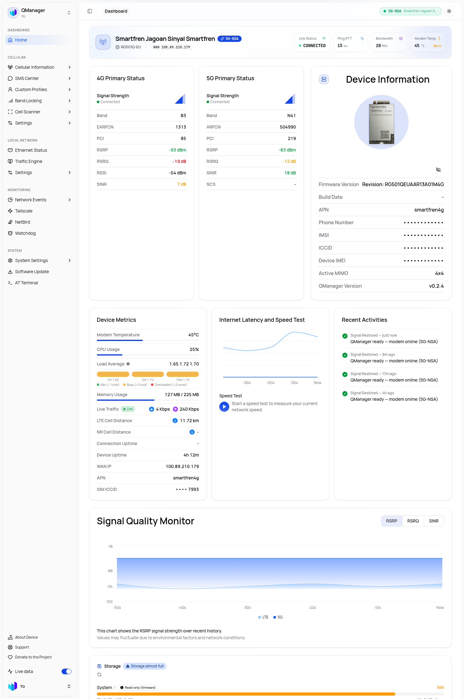

# QManager — Universal Go Edition 🚀

<div align="center">
  
  <h3>Universal, High-Performance Go-Powered GUI & Core for Cellular Modem Management</h3>
  <p>Visualize, configure, and optimize Quectel & Universal cellular modems with an ultra-lightweight Go backend and React 19 UI</p>

  
  
  
  
  
  
  
</div>

---

<div align="center">
  
</div>

---

## ⚡ Installation Guide

This project is **deployed onto the modem itself** (Quectel RM500Q / RM520N /
RM551E class devices running Linux). There is no separate server to install -
you build the binary on your workstation, then upload it to the modem over
SSH and let systemd run it.

> **What this guide is NOT**: this is not a generic "download a binary and
> run it on your PC" tutorial. The steps below match the real (tested)
> installation flow: build from source with `build-go.sh`, push the binary to
> `/usrdata/qmanager/qmanager-core`, and manage it with
> `qmanager-core.service` (systemd).

---

### 0. Requirements

| What | Where | Notes |
|---|---|---|
| Target modem | LAN IP `192.168.225.1`, SSH `root` (pass: `admin321`) | Quectel RM500Q-GL (armv7) |
| Go toolchain | Workstation | 1.24+ (`GOTOOLCHAIN=local`) |
| Bun | Workstation (optional) | Only needed when you rebuild the frontend |
| SCP/SFTP | **NOT required** | The modem has no `scp`/`sftp` - use the base64 pipe below |

---

### 1. Build

```sh
cd QManager-GO
./build-go.sh
```

`build-go.sh` does two things:
1. Builds the Next.js frontend and embeds it into the Go binary
   (`//go:embed all:out`).
2. Cross-compiles `qmanager-core` for your target architecture.

Output: `backend/dist/qmanager-core-<arch>` (e.g. `qmanager-core-armv7`).

Manual alternative (same result):

```sh
cd backend
export PATH=$HOME/go124/bin:$PATH GOTOOLCHAIN=local
GOOS=linux GOARCH=arm GOARM=7 CGO_ENABLED=0 \
  go build -ldflags="-s -w" -o qmanager-core-armv7 ./cmd/server
```

---

### 2. Deploy to the Modem

#### Option A (recommended): `deploy.sh` from your workstation

```sh
# Deploy over SSH to the default modem IP
./deploy.sh

# Or to a custom IP
./deploy.sh 192.168.1.1

# Or over ADB (if SSH is not available)
./deploy.sh adb
```

Notes:
- The script detects the target architecture and pushes the matching binary.
- It creates the systemd unit in **`/lib/systemd/system/`** (NOT `/etc` - see the
  boot quirk below) and enables autostart.
- On modems **without** `scp`/`sftp` the script's SCP step fails - use Option B.

#### Option B (manual, works on modems without SCP - tested on RM500Q)

Upload the binary over SSH using a base64 pipe (the modem has busybox only):

```sh
BIN=backend/dist/qmanager-core-armv7
TARGET=root@192.168.225.1

base64 "$BIN" | ssh "$TARGET" 'base64 -d > /usrdata/qmanager/qmanager-core.new \
  && chmod +x /usrdata/qmanager/qmanager-core.new \
  && mv /usrdata/qmanager/qmanager-core.new /usrdata/qmanager/qmanager-core \
  && systemctl restart qmanager-core'
```

This keeps the previous binary at `/usrdata/qmanager/qmanager-core` until the
new file is fully transferred, then swaps it atomically (`mv`).

Install path summary:
- **Binary**: `/usrdata/qmanager/qmanager-core`
- **Config dir**: `/etc/qmanager/` (`qmanager.conf` JSON + `auth.json`
  sha256(salt+password))
- **TLS certs**: auto-generated by tlsgen into `/etc/qmanager/tls/`
- **Web assets (optional)**: `/usrdata/qmanager/web` when `WEB_ROOT` is set

---

### 3. Systemd Autostart

`deploy.sh` writes the unit for you. Manual reference:

```ini
[Unit]
Description=QManager Go Core Service
After=basic.target

[Service]
Type=simple
ExecStart=/lib/qmanager-start.sh      # wrapper on rootfs, NOT the binary path
Restart=always
RestartSec=2
KillMode=process
Environment=PORT=80
Environment=TLS_PORT=443
Environment=TLS_ENABLED=true
Environment=WEB_ROOT=/usrdata/qmanager/web

[Install]
WantedBy=multi-user.target
```

> ⚠️ **Quectel boot quirks (do not skip):**
> - **Unit must live in `/lib/systemd/system/`, not `/etc`** - on Quectel the
>   `/etc` path lives on the late-mounted `ubi2_0` volume, so systemd silently
>   skips custom units there during cold boot. `/lib` is processed.
> - **`ExecStart` must point at a rootfs wrapper** (e.g.
>   `/lib/qmanager-start.sh`) - pointing directly at
>   `/usrdata/qmanager/qmanager-core` makes systemd derive
>   `RequiresMountsFor=/usrdata/qmanager`, which cannot resolve at boot and the
>   unit is skipped.
> - **Do NOT use `After=network-online.target`** - it stays inactive during
>   cold boot on Quectel; `After=basic.target` starts the service immediately.
> - **`systemctl is-enabled` lies on Quectel** - it only reads `/etc` state.
>   Verify autostart with `ls /lib/systemd/system/multi-user.target.wants/`
>   + a reboot test, not `is-enabled`.

Enable & restart:

```sh
ssh root@192.168.225.1 \
  "systemctl daemon-reload && systemctl restart qmanager-core"
```

Verify:

```sh
curl -sk -o /dev/null -w '%{http_code}\n' https://127.0.0.1/   # -> 200
```

---

### 4. Updating Only the Frontend (no Go rebuild needed)

The service is configured with `WEB_ROOT=/usrdata/qmanager/web`, so the
frontend is served from disk. To update the UI without rebuilding Go:

```sh
bun --bun next build   # run from repo root; output goes to out/
tar -C out -cf - . | base64 | ssh root@192.168.225.1 \\
  'base64 -d | tar -C /usrdata/qmanager/web -xf -'
ssh root@192.168.225.1 "systemctl restart qmanager-core"
```

---

### 5. Post-Install Checklist & Warnings

- [ ] `https://192.168.225.1` loads the dashboard (login = admin)
- [ ] `qmanager-core` is active (`systemctl is-active qmanager-core` → active)
- [ ] **NEVER start `qmanager-scheduled-reboot.service` manually** - it reboots
      the modem instantly. Keep the timer disabled.
- [ ] If you migrated from the legacy QManager: lighttpd must stay masked and
      the iptables `DROP` rules for port 80/443 must be removed
      (`iptables -D INPUT N`) or the dashboard is unreachable over IPv4.
- [ ] After a modem reboot, `/tmp` state files (events, ping history) are
      regenerated by the shell poller - empty responses right after reboot are
      normal.

If you are migrating from legacy QManager / SimpleAdmin / QuecManager, follow
the cleanup section below **after** QManager-Go is already running.

## 🔄 Removing Legacy QManager / SimpleAdmin / QuecManager (Full Migration to QManager-Go)

If your modem previously ran **legacy QManager (PHP/Python/Lighttpd)**, **SimpleAdmin**, or **QuecManager**, this guide removes ALL of it so your modem runs **exclusively** on QManager-Go.

### 1. What Happens to Legacy Software?
- **Port Conflict (80/443)**: `qmanager-core` is a standalone Go binary with an embedded Next.js SPA frontend and native HTTP server on Port 80/443. Anything else bound to those ports (lighttpd, SimpleAdmin, python) must be removed.
- **Data & Config Preserved**: `qmanager-core` reads/writes the exact same `/etc/qmanager/` config directory (APN, band locks, SIM profiles, DNS, tower locks). Migration will **NOT** delete saved SIM profiles or settings.
- **Security**: Legacy SimpleAdmin ships dangerous leftovers — a world-writable `.htpasswd`, `www-data` sudoers granting `cat`/`echo` as root (read `/etc/shadow`), and AT-bridge socat daemons. All of these are removed below.

### 2. Stop & Disable All Legacy Services

```sh
ssh root@192.168.225.1

# Legacy web daemons (lighttpd / python / QuecManager)
systemctl stop lighttpd 2>/dev/null; systemctl disable lighttpd 2>/dev/null
/etc/init.d/lighttpd stop 2>/dev/null; /etc/init.d/lighttpd disable 2>/dev/null
killall -9 lighttpd python python3 2>/dev/null

# SimpleAdmin helper daemons (firewall, socat AT-bridge, TTL override, auto-update)
systemctl stop simplefirewall ttl-override install_simpleadmin 2>/dev/null
systemctl disable simplefirewall ttl-override install_simpleadmin 2>/dev/null

for u in socat-smd11 socat-smd11-from-ttyIN socat-smd11-to-ttyIN \
         socat-smd7 socat-smd7-from-ttyIN2 socat-smd7-to-ttyIN2 socat-killsmd7bridge; do
  systemctl stop $u 2>/dev/null; systemctl disable $u 2>/dev/null
done

# Purge stale systemd unit references (rootfs is read-only; disable is enough)
systemctl daemon-reload
```

### 3. Delete Legacy Directories & Dangerous Files

```sh
# SimpleAdmin + socat + firewall + auto-updater directories
rm -rf /usrdata/simplefirewall /usrdata/simpleupdates /usrdata/socat-at-bridge

# Old QManager web assets (kept as backup by past deploy scripts)
rm -rf /usrdata/qmanager/web.old

# World-writable password files & helper scripts (privilege-escalation risks)
rm -f /opt/etc/.htpasswd /usrdata/opt/etc/.htpasswd
rm -f /usrdata/cfun_fix.sh
rm -f /usrdata/root/bin/simplepasswd /usrdata/root/bin/htpasswd

# Broken cron referencing a removed watchcat script
sed -i '/watchcat.sh/d' /etc/crontab

# Stale udev rule pointing at a removed helper (spams boot errors)
rm -f /etc/udev/rules.d/99-qmanager-smd11.rules
udevadm control --reload 2>/dev/null

# Purge leftover systemd units for removed helpers.
# /lib is read-only on Quectel rootfs - remount rw briefly to delete.
mount -o remount,rw /
rm -f /lib/systemd/system/cfunfix.service
rm -f /lib/systemd/system/ipacm_perf.service        # binary /usr/bin/ipacm_perf missing (zombie)
rm -f /lib/systemd/system/rc.unslung.service        # Entware init dupe - SSH is managed by systemd sshd
rm -f /lib/systemd/system/multi-user.target.wants/cfunfix.service
rm -f /lib/systemd/system/multi-user.target.wants/simplefirewall.service
rm -f /lib/systemd/system/multi-user.target.wants/socat-*.service
rm -f /lib/systemd/system/multi-user.target.wants/ttl-override.service
rm -f /lib/systemd/system/multi-user.target.wants/install_simple*.service
rm -f /lib/systemd/system/multi-user.target.wants/ipacm_perf.service
rm -f /lib/systemd/system/multi-user.target.wants/rc.unslung.service
rm -f /lib/systemd/system/simplefirewall.service /lib/systemd/system/ttl-override.service
rm -f /lib/systemd/system/socat-*.service
rm -f /lib/systemd/system/install_simpleadmin.service
systemctl daemon-reload
mount -o remount,ro /
```

> ⚠️ Unit files under `/lib/systemd/system/` live on the read-only rootfs — but you CAN delete them by briefly remounting `rw` (as shown above), then back to `ro`. This is the only way to truly purge legacy SimpleAdmin/socat units; `systemctl disable` alone leaves the wants symlink in `/lib` and systemd keeps trying to start it each boot (noisy failures).

### 4. Harden `www-data` Sudoers (Kill Privilege Escalation)

Legacy SimpleAdmin grants `www-data` passwordless `cat`/`echo` as root, which lets a compromised web user read `/etc/shadow` and write arbitrary files. QManager-Go runs as **root** and does not need those. Strip them from **both** sudoers copies:

```sh
for f in /opt/etc/sudoers.d/www-data /usrdata/opt/etc/sudoers.d/www-data; do
  [ -f "$f" ] && sed -i 's|, /bin/echo, /bin/cat||' "$f"
done
# Verify: should now print "sudo: a password is required"
sudo -u www-data sudo -n cat /etc/shadow
```

### 5. Install Persistent Firewall (Block Internet Access to Dashboard)

`qmanager-core` listens on `:80/:443/:8838` bound to ALL interfaces — including `rmnet_data0` (the SIM WAN link). Without a firewall the dashboard is reachable from the public internet. Add a persistent, idempotent firewall service:

```sh
cat > /usrdata/qmanager-firewall.sh <<'EOF'
#!/bin/sh
# QManager firewall: block internet (rmnet_data0) access to modem services, keep LAN.
iptables -C INPUT -i rmnet_data0 -p tcp --dport 80 -j DROP  2>/dev/null || iptables -A INPUT -i rmnet_data0 -p tcp --dport 80 -j DROP
iptables -C INPUT -i rmnet_data0 -p tcp --dport 443 -j DROP 2>/dev/null || iptables -A INPUT -i rmnet_data0 -p tcp --dport 443 -j DROP
iptables -C INPUT -i rmnet_data0 -p tcp --dport 8838 -j DROP 2>/dev/null || iptables -A INPUT -i rmnet_data0 -p tcp --dport 8838 -j DROP
iptables -C INPUT -i rmnet_data0 -p tcp --dport 22 -j DROP 2>/dev/null || iptables -A INPUT -i rmnet_data0 -p tcp --dport 22 -j DROP
exit 0
EOF
chmod +x /usrdata/qmanager-firewall.sh

cat > /etc/systemd/system/qmanager-firewall.service <<'EOF'
[Unit]
Description=QManager Firewall (block internet access to modem services)
After=network.target
Before=qmanager-core.service

[Service]
Type=oneshot
ExecStart=/usrdata/qmanager-firewall.sh
RemainAfterExit=yes

[Install]
WantedBy=multi-user.target
EOF

systemctl daemon-reload
systemctl enable --now qmanager-firewall
```

### 6. Enable & Start QManager Go Edition (Autostart on Boot)

```sh
systemctl daemon-reload
systemctl enable qmanager-core
systemctl restart qmanager-core

# Verify
systemctl is-enabled qmanager-core   # → enabled
systemctl is-active  qmanager-core   # → active
curl -sk -o /dev/null -w '%{http_code}\n' https://127.0.0.1/  # → 200
```

> ⚠️ **Quectel cold-boot quirk**: on RM500Q/RM520N the full boot takes ~80s (`network.target` + QCMAP bring-up). SSH usually comes up in 1–2 min; `qmanager-core` may start ~80s after power-on even when enabled. That is normal — do not mistake it for a failed autostart. If you need web up sooner, use `After=basic.target` in the unit instead of `After=network.target` (see Step 2 note above).
>
> ⚠️ **`systemctl is-enabled` lies on Quectel**: it reports `disabled` for units whose wants symlink lives in `/lib` (it only reads `/etc` state). Ignore it — the boot-time authority is the wants symlink itself. Verify with `ls /lib/systemd/system/multi-user.target.wants/qmanager-*` + a reboot test, not `is-enabled`. Do NOT run `systemctl enable` after placing units in `/lib` — it duplicates the symlink into `/etc` (harmless but confusing) and then `is-enabled`/`is-active` read from there.

### 7. 🧹 Clean Legacy QManager Config + Lighttpd (Full Clean-Room)

After QManager-Go is running, clean up the **old config files and web servers**
left by legacy QManager (PHP/Python/Lighttpd) / SimpleAdmin so nothing holds
port 80/443, nothing writes stale data, and the boot log is silent.

#### 7a. Remove Lighttpd + legacy web stack

```sh
ssh root@192.168.225.1

# Stop & disable lighttpd (systemd + init.d + native)
systemctl stop lighttpd 2>/dev/null; systemctl disable lighttpd 2>/dev/null
/etc/init.d/lighttpd stop 2>/dev/null; /etc/init.d/lighttpd disable 2>/dev/null
killall -9 lighttpd python python3 php-cgi 2>/dev/null

# Lighttpd config + runtime dirs (usually on the writable ubi2_0 volume)
rm -rf /etc/lighttpd /usrdata/etc/lighttpd /var/log/lighttpd /run/lighttpd
rm -f  /etc/init.d/lighttpd /lib/systemd/system/lighttpd.service 2>/dev/null

# Legacy document root + CGI (php/python .cgi handlers from QuecManager)
rm -rf /www /usrdata/www /usrdata/cgi-bin /usrdata/php* /usrdata/etc/php*

# Any mod_cgi / fastcgi php leftovers
rm -rf /usrdata/php-fpm* /usrdata/etc/php-fpm* /usrdata/var/run/php-fpm* 2>/dev/null

mount -o remount,rw / 2>/dev/null
rm -f /lib/systemd/system/lighttpd.service 2>/dev/null
mount -o remount,ro / 2>/dev/null
systemctl daemon-reload
```

#### 7b. Clean legacy QManager config files (keep the live ones!)

`qmanager-core` reads/writes `/etc/qmanager/` — **do NOT wipe the whole dir**.
Keep the files it uses, delete only legacy leftovers:

- **KEEP**: `auth.json`, `profiles/`, `qmanager.conf`, `ping_profile.json`,
  `quality_thresholds.json`, `tower_lock.json`, `alert_routing.json`,
  `custom_dns.json`, `adaptive_polling.json`, `mtu.json`, `imei_backup.json`,
  `known_iccids`, `crash.log`, `VERSION`, `sessions.json` (managed live),
  `active_scenario`, `last_boot_id`, `band_failover.enabled` +
  `band_failover_enabled` (both are read by current builds — keep them,
  they are 1-char flags), `environment` (log level), `long_commands.list`
  (AT command allow-list used by the AT terminal).
- **DELETE (legacy only, if present)**: `.htpasswd` (SimpleAdmin basic-auth),
  stale `*.sh` / `*.cgi` / `*.tmp` / `*.old` / `*.bak` files.

```sh
# Safe cleanup — only touches known-legacy files
cd /etc/qmanager
rm -f .htpasswd *.tmp *.old *.bak *.cgi 2>/dev/null
ls -la /etc/qmanager/  # review what remains
```

> ⚠️ **Never** blindly `rm -rf /etc/qmanager` — you will wipe your APN
> profiles, band locks and dashboard password with it.

#### 7c. Verify a clean state

```sh
# 1. Only qmanager-core may own ports 80/443/8838
netstat -tlnp 2>/dev/null | grep -E ':(80|443|8838)'

# 2. No legacy daemons alive
ps w | grep -iE 'lighttpd|php|socat|simpleadmin' | grep -v grep || echo CLEAN

# 3. Boot log has no stale service failures
dmesg | grep -iE 'socat|simplefirewall|cfunfix' | tail -3   # expect: empty

# 4. Dashboard up & protected
curl -sk -o /dev/null -w '%{http_code}\n' https://127.0.0.1/          # 200
curl -sk -o /dev/null -w '%{http_code}\n' \
  https://127.0.0.1/cgi-bin/quecmanager/at_cmd/send_command.sh        # 401 (auth)
```

After this the modem is a **clean-room QManager-Go**: single binary on
80/443, firewall up, no legacy web stack, minimal /etc/qmanager.

---

## 📱 Supported Modem Hardware & Platforms

`QManager Go Edition` is engineered to be 100% universal across all Quectel 4G/5G cellular modems and host environments:

| Hardware Platform | Qualcomm Chipset | Operating System | Binary Executable | Target Modem Devices |
| :--- | :--- | :--- | :--- | :--- |
| **ARMv7 32-bit (SDX55 / SDX62 / SDX65)** | SDX55, SDX62, SDX65 | Linux + Systemd | `qmanager-core-armv7` | **Quectel RM520N-GL**, RM500Q-GL, RM502Q-AE, **RG501Q-EU**, RM521F-GL |
| **ARMv8 64-bit / ARM64 (SDX72 / SDX75)** | SDX72, SDX75 | Native OpenWRT (`init.d`) | `qmanager-core-arm64` / `armv7` | **Quectel RM551E-GL**, RM550E-GL, RG650V-EU |
| **Host Router & Gateways (ARM64)** | Any (Passthrough) | OpenWRT / Linux | `qmanager-core-arm64` | Raspberry Pi 4/5, NanoPi, GL.iNet, FriendlyWrt |
| **PC & Router Hardware (x86_64)** | Any (Passthrough) | Linux / OpenWRT x86 | `qmanager-core-amd64` | x86 Routers, Mini PCs, MikroTik CHR, Linux VMs |

---

## 🛠️ Building QManager Go Edition

To build the complete single-executable binary (`qmanager-core`) containing the embedded Next.js frontend:

```sh
# Clone the repository
git clone https://github.com/latifangren/QManager-GO.git
cd QManager-GO

# Run the unified multi-architecture build script
./build-go.sh
```

**Compiled Executables (`backend/dist/`):**
* `qmanager-core-armv7` (Quectel RM520N / ARM 32-bit)
* `qmanager-core-arm64` (Raspberry Pi 4/5, Router ARM64)
* `qmanager-core-amd64` (PC / X86_64 Router / VM)
* `qmanager-core` (Default alias ARMv7)

---

## ⚙️ Environment Variables Reference

| Environment Variable | Default Value | Description |
| :--- | :--- | :--- |
| `PORT` | `80` | HTTP server listening port |
| `TLS_PORT` | `443` | HTTPS server listening port (Auto TLS) |
| `TLS_ENABLED` | `true` | Set to `false` to disable auto-generated TLS certificates |
| `WEB_ROOT` | *(Embedded)* | Optional filesystem path to static web assets if overriding `embed.FS` |
| `AT_DEVICE` | `/dev/smd11` | Custom AT serial device path |

---

## 🌐 Supported REST API Endpoints

QManager Go Edition maintains 100% route compatibility with legacy CGI endpoints:

| Endpoint Path | Description |
| :--- | :--- |
| `/cgi-bin/quecmanager/auth/login.sh` | Authenticate user & issue session cookie |
| `/cgi-bin/quecmanager/auth/check.sh` | Verify current session validity |
| `/cgi-bin/quecmanager/at_cmd/fetch_data.sh` | Retrieve live modem status JSON |
| `/cgi-bin/quecmanager/at_cmd/send_command.sh` | Safely execute raw AT commands |
| `/cgi-bin/quecmanager/cellular/radio_details.sh` | On-demand timing advance & DNS readout |
| `/cgi-bin/quecmanager/profiles/list.sh` | List saved SIM profiles |
| `/cgi-bin/quecmanager/bands/current.sh` | Query active LTE & 5G NR band locks |
| `/cgi-bin/quecmanager/bands/lock.sh` | Apply LTE/5G band lock configuration |
| `/cgi-bin/quecmanager/cellular/sms.sh` | Storage-aware SMS list, send, and delete |
| `/cgi-bin/quecmanager/tower/lock.sh` | 4G & 5G NR SA Cell/Tower Locking |
| `/cgi-bin/quecmanager/frequency/lock.sh` | EARFCN/ARFCN Channel Locking |
| `/cgi-bin/quecmanager/network/data_used.sh` | Real-time byte counters & throughput |
| `/cgi-bin/quecmanager/system/reboot.sh` | Execute system or modem reboot |
| `/cgi-bin/quecmanager/health` | Go backend health check & system architecture |

---

## 💙 License & Acknowledgments

This project is licensed under the **[MIT License with Commons Clause](LICENSE)**.

- Built upon the foundations of **[QManager Universal](https://github.com/dr-dolomite/QManager)** by [DrDolomite](https://github.com/dr-dolomite).
- Inspired by concepts from **[QuecTool](https://github.com/snowzach/quectool)**.
